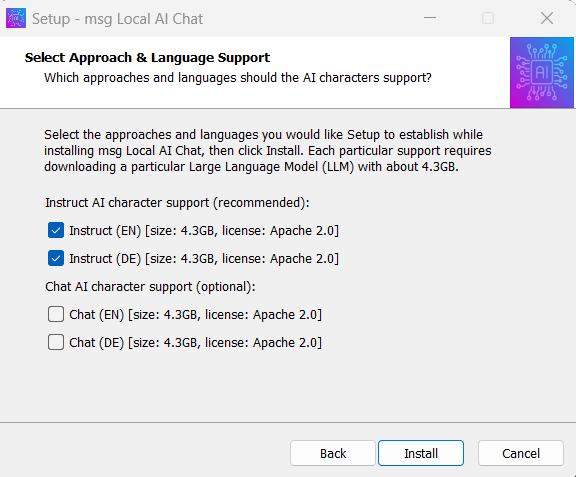

msg Local AI: Chat
==================

About
-----

**msg Local AI: Chat** is an application to locally run
Large Language Model (LLM) based generative Artificial
Intelligence (AI) characters (aka "chat-bots"). It is based
on the freely available [*Faraday*](https://faraday.dev) LLM
host application, four pre-installed Open Source
[*Mistral 7B*](https://mistral.ai/news/announcing-mistral-7b/) LLMs, and 24
pre-configured Faraday AI characters. Each Faraday AI character is a
combination of a pre-selected LLM (fine-tuned for instruct or chat use),
pre-configured LLM parameters, and a corresponding pre-configured LLM
system prompt.

**msg Local AI: Chat** is intended both as a learning application for
Generative AI Prompt Engineering and as a production application for
leveraging from generic text-based generative AI use-cases under full
offline-first and GDPR-compliance aspects.

Notice
------

Notice on STATISTICS: **msg Local AI: Chat** uses the *Faraday* LLM host
application. *Faraday* sends anonymous usage information to its vendor.
*msg Research* explicitly checked this communication in 2024/02 and
considers it harmless from a GDPR point of view, as no personal
information were contained in the sent data.

Notice on CLOUD: **msg Local AI: Chat** uses the *Faraday* LLM host
application. *Faraday* provides the possibility to create an account in
the Cloud on `faraday.dev`, login to it from within the application,
and use this account to upload and share chats and AI characters via
the Cloud. For the intended use of **msg Local AI: Chat** none of this is
functionality required or even recommended. The user is in charge when
using this additional functionality of *Faraday*.

Notice on CONTENT: **msg Local AI: Chat** uses *uncensored* LLMs which were
trained by *Mistral AI* with huge amounts of unknown, publicly available
data from the Internet. Hence the AI characters responses contain all
type of public information and in an entirely *unfiltered* format. The
user is responsible to treat the responses with care and especially
always consider and evaluate the responses in the context of the current
law and current social morality.

Notice on QUALITY: **msg Local AI: Chat** is based on the decent but rather
small Open-Source LLM *Mistral 7B* in order to run even on computers
with very constrained RAM and CPU resources. As a consequence, the
overall response quality obviously is noticeably reduced in contrast
to state-of-the-art chat-bots, like the commercial *GPT-3.5/GPT-4* based
*OpenAI ChatGPT*.

Screenshots
-----------

Copyright & License
-------------------

- Faraday (Host Application) is Copyright &copy; 2023-2024 Ahoy Labs, Inc. 
  Faraday (Host Application) is distributed as freely available software.

- Mistral 7B (LLM) is Copyright &copy; 2023-2024 Mistral AI 
  Mistral 7B (LLM) is distributed as Open Source under Apache 2.0 license.

- msg Local AI: Chat (Configuration & Installer) is Copyright &copy; 2024 msg systems ag 
  msg Local AI: Chat (Configuration & Installer) is distributed as Open Source under Apache 2.0 license.

